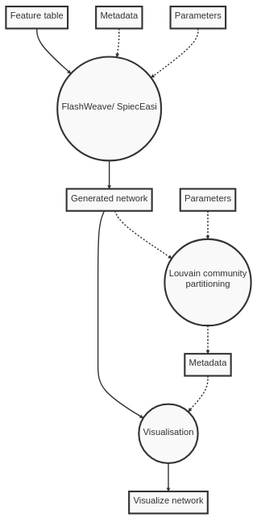

# Summary

**q2-makarsa** is a plugin for the QIIME 2 microbiome bioinformatics platform.
The plugin allows biologists to infer and visualise microbial
ecological networks from compositional data. Ecological networks provide a
method for detecting community structure and identifying key species, peptides,
or any biologically meaningful covariates.

# Statement of need

The bacteria, fungi, viruses, and other microbes that inhabit a specific
habitat are known collectively as a microbiome. The microbiomes that occupy the
human body crucially impact human health in positive and negative ways
[@berg2020microbiome]. Microbe-microbe and host-microbe interactions may play a
significant role in many areas; for example, food science
[@singh2017microbiome; @torrazza2011developing], health
science [@torrazza2011developing] and agricultural production
[@berg2020microbiome]. Understanding the functions, interactions, temporal and
spatial structures, and population dynamics of microbial communities, will lead
to breakthroughs in those areas. To discover the interactions among microbiota
within or between ecosystems, network analysis is an important starting point.
It allows us to investigate questions from the species level to the community
level within a common formal mathematical framework [@delmas2019analysing].
Here, we present a QIIME 2 plugin [@Bolyen2019] that will help to infer
microbial interactions by using network analysis.

**q2-makarsa** makes two popular microbial network inference methods,
SpiecEasi [@kurtz2015sparse] and FlashWeave [@tackmann2019rapid] and a method 
to obtain node communities based on the Louvain algorithm [@Blondel_2008], 
available to users of the [QIIME 2](https://qiime2.org/) bioinformatics 
platform and bundles it with a new tool
for visualising the inferred networks and producing publication-ready figures.
By bringing these methods into the QIIME 2 platform, users can take data from 
laboratory to plot without breaking QIIME 2's distributed provenance tracking,
improving scientific reproducibility. QIIME 2 also provides users with greater
convenience by allowing non-specialists to access tools from, for instance,
the [Galaxy](https://usegalaxy.org/) graphical user interface or the command line,
rather than from R or Julia, greatly increasing their usability and audience.
Additionally, by providing users easy access to these competing methods
of network inference, users can compare and assess the robustness of
network inference on their data.

# Summary of functionality

SpiecEasi
has been widely adopted by the microbiome research community and
has been cited in over 1000 scientific publications [@google2023]. SpiecEasi
has been rigorously tested and benchmarked against other methods for microbial
network analysis and has been shown to perform well across a variety of
datasets and scenarios.

FlashWeave [@tackmann2019rapid] is a newer package
used for microbial network analysis, and it is gaining popularity and
acceptance in the scientific community for its novel algorithm, large-scale
analysis, and multinomics integration properties. Both packages are actively
developed and maintained by dedicated teams of developers, which means that
they are regularly updated and improved with new features and bug fixes.
Overall, SpiecEasi and FlashWeave are powerful tools for analyzing microbial
data and identifying potential interactions between microbial taxa.

To simplify the complexity of the network a widely used approach is to obtain
a community partition of nodes. For this goal the Louvain algorithm 
[@Blondel_2008] is widely used, which is implemented in the python library 
Networkx [@SciPyProceedings_11]. This algorithm maximizes the modularity to 
obtain the communities and is not deterministic. It has also been shown that 
a consensus of multiple partitions obtained from the same clustering method 
consensus allows to obtain a partition that is closer to the actual community 
structure of the system [@Lancichinetti2012].

The current version of **q2-makarsa** exposes SpiecEasi and FlashWeave via the
QIIME 2 actions `spiec-easi` and
`flashweave` respectively. Additionally it enables exploring the community 
structure of the network via the `louvain-communities` action.
Specifically, **q2-makarsa** makes available: 

* All of [SpiecEasi's](https://github.com/zdk123/SpiecEasi) features except
  batch-mode execution (thread-level parallelism is supported);
* [FlashWeave's](https://github.com/meringlab/FlashWeave.jl) `learn_network`
  features in their entirety.
* A consensus of Louvain community partitions obtained through the algorithm
  proposed by 
  [Lancichinetti & Fortunato, 2012](https://www.nature.com/articles/srep00336#Sec7).

The universal visualisation method is accessed by the option
`visualise-network`, which takes generated network as input and
visualizes it in a publication-quality figure. This option combined with
QIIME 2 `view` tool allows the user to understand the inferred ecological 
network is a variety of ways.

The visualizer of
q2-makarsa offers a series of features that distinguish it from other network visualization tools,
for example,

* The network is interactive and its overall size and shape on the screen can
  be manipulated manually within the user's browser.
* A publication ready image of the network can be saved to the local device in
  PNG format.
* Network nodes can be selected and information on each feature (eg. ASVs,
  OTUs, MVs, taxa, peptides) is represented by the node, statistics, and
  various centrality measures for the node will be displayed.
* Node attributes can be added via feature metadata (eg. taxonomy, DNA
  sequence, differential abundance scores). If the node attributes are
  taxonomic labels, visualisation offers colourings at any taxonomic level
* Network edges are colour coded for positive (blue) and negative (orange)
  correlations
* Edge thickness is scaled according to statistics appropriate to each method
  with thicker edges indicating stronger associations between features.
* Node size is scaled according user-selected statistics such as centrality
  measures.
* Nodes can be colour coded according to user-selected categories such as
  taxonomic classification.
* Disjoint inferred networks are displayed in their own tabs.
* Settings are synchronised across tabs meaning that if you have multiple tabs
  open in the visualisation, any changes you make to the settings (such as the
  scaling of edges or nodes) will be applied to all tabs at once.

\autoref{fig:visual} is an example of a PNG image saved directly from
the visualiser. This figure is a visualisation of the networks inferred from the 
QIIME 2 Parkinson's Mouse Tutorial data [@pdmice] using FlashWeave. Nodes represent
ASV (Amplicon Sequence Variants), are coloured by taxonomic classification, and 
sized proportional to their ANCOM W statistic [@mandal2015analysis]. In this instance the ANCOM
W statistic gives an indication of how differentially abundant ASVs are between
healthy and Parkinson's Disease-affected donor mice.

The plugin workflows are summarised in \autoref{fig:grl}.

{width=100%}

{width=40%}  

The plugin is freely available under the [BSD-3-Clause license](https://github.com/BenKaehler/q2-makarsa/blob/main/LICENSE).
SpiecEasi and FlashWeave must be installed and used under their licensing restrictions.
Installation instructions, a usage tutorial, and example outputs are given on the [project
website](https://isaactowers.github.io/q2-makarsa/).

# Comparison with other similar packages

Many network visualisation tools exist. For instance, the SpiecEasi documentation recommends
igraph [@csardi2006igraph] and the FlashWeave documentation recommends Cytoscape [@shannon2003cytoscape]
or Gephi [@bastian2009gephi]. q2-makarsa differs from this approach by combining those inference
tools with a customised visualisation tool and community detection without the need for the
user to code in R or Julia.

Other pipelines exist that are more similar to q2-makarsa, for instance MicNet [@favila2022micnet],
CoNet [@faust2016conet], and NetCoMi [@peschel2021netcomi]. MicNet offers a web interface, similar tools,
and an active GitHub repository. CoNet is a Cytoscape plugin that can perform inference on microbial
count data. NetCoMi is an R package that provides access to similar tools (notably SpiecEasi) and is also
actively maintained. These pipelines offer varying features but none are QIIME 2 plugins so would break
provenance tracking for QIIME 2 users, and none offer FlashWeave for network inference or Louvaine
community detection.

# Acknowledgements

The authors acknowledge support from University of Dhaka, Bangladesh and UNSW
Canberra, Australia. This work is a partial fulfilment of PhD research at
UNSW Canberra.

# References

