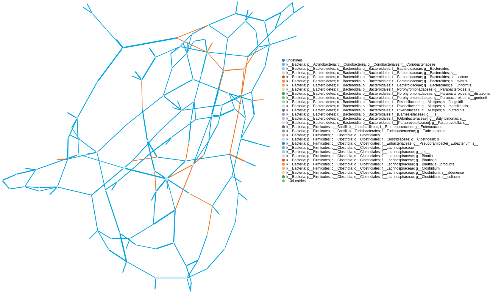
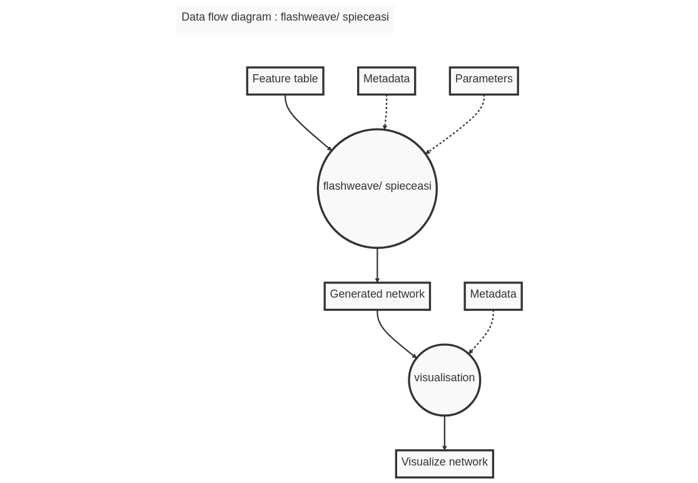

# Summary

**q2-makarsa** is a plugin for the QIIME 2 microbiome bioinformatics platform. The plugin allows the QIIME 2 community to infer microbial ecological networks from compositional data using a range of leading tools. Ecological networks provide a method for detecting community structure and identifying key species, peptides, or any biologically meaningful covariates.

# Statement of need

The bacteria, fungi, viruses, and other microbes that inhabit a specific habitat are known collectively as a microbiome. The microbiomes that occupy the human body crucially impact human health in positive and negative ways [@berg2020microbiome]. Microbe-microbe and host-microbe interactions may play a significant role in many areas; for example, food science [@singh2017microbiome; @torrazza2011developing; @foodsecurity2017], health science [@torrazza2011developing; @diease2011] and agricultural production [@berg2020microbiome]. Understanding the functions, interactions, temporal and spatial structures, and population dynamics of microbial communities, will lead to breakthroughs in those areas. To discover the interactions among microbiota within or between ecosystems, network analysis is an important starting point. It allows us to investigate questions from the species level to the community level within a common formal mathematical framework [@delmas2019analysing]. Here, we present a QIIME 2 plugin that will help to infer microbial interactions by using network analysis.

**q2-makarsa** exposes the functionality of SpiecEasi[@kurtz2015sparse] and FlashWeave[@tackmann2019rapid], two popular tools for microbial network analysis. Among currently available microbial network analysis tools, SpiecEasi has been comparatively widely adopted by the microbiome research community and has been cited in over 996 scientific publications [@kurtz2015sparse; @vine2006google]. SpiecEasi has been rigorously tested and benchmarked against other methods for microbial network analysis and has been shown to perform well across a variety of datasets and scenarios. FlashWeave [@tackmann2019rapid] is another new package used for microbial network analysis, and it is gaining popularity and acceptance in the scientific community for its novel algorithm, large-scale analysis, and multiomics integration properties. Both of the packages are actively developed and maintained by dedicated teams of developers, which means that they are regularly updated and improved with new features and bug fixes. Overall, SpiecEasi and FlashWeave are powerful tools for analyzing microbial data and identifying potential interactions between microbial taxa.

**q2-makarsa** performs network analysis of microbiome data. It has two methods for network generation and one visualizer to visualize the generated network.  The name of available methods in q2-makarsa are spieceasi and flashweave, which call SpiecEasi and FlashWeave respectively to generate an ecological network for given compositional data. 

In spieceasi,ecological interactions between microbial populations are infered by 

- taking advantage of the proportionality invariance of relative abundance data and 
- making assumptions about the underlying network structure when the number of taxa in the dataset is larger than the number of sampled communities [@kurtz2015sparse].

It provides several methods for neighbourhood selection, for example mb, glasso, slr etc, and uses StARS for model selection. There are several other parameters that are also used in this plugin, for more details please visit . 

On the otherhand,FlashWeave uses a statistical approach to infer these relationships based on conditional mutual information tests, which allows it to handle both linear and non-linear relationships between variables. Additionally, FlashWeave includes various algorithmic parameters, such as heterogeneous and sensitive, which can be used to optimize performance and sensitivity based on the specific properties of the dataset being analyzed. Finally, FlashWeave is a valuable tool for microbial network analysis because it allows researchers to identify potentially important relationships between microbes in complex communities, which can help to better understand the underlying biology and potentially lead to the development of new therapies or interventions for various diseases. To learn more about FlashWeave and its user manual, please visit .

The name of the visualizer of this plugin is 'visualisation' which takes generated network as input and visualizes it in a publication-quality figure which can be saved as png format into local machine. The visualizer provides portable, shareable reports, and integrated decentralized data provenance. In this visualizer, we have attached some statistical attributes to the network generated from the spieceasi and flashweave methods to make our network more attractive and informative. For example, we have added different centrality measurements as node attributes in the generated network. In this case, we have used betweenness centrality, degree centrality, closeness centrality, eigenvector centrality, and associativity to measure the centrality properties of nodes, which can be used in visualisation as the size of the nodes of the generated network. By doing this we can easily identify which node has the most betweenness value in that network, in other words, which microbial species is most influential in that ecological network. Nodes can also be coloured according to user-selected categories such as taxonomic classification. If user select a perticular node in visualize network, information on which feature is represented by node, statistics and various centrality measures for that node will be displayed. We also have added weights of interactions as edges attribute, although a weighted network is only available for mb and glasso methods, which will help to identify the pair of microbial taxa which have the most interactions among any other pair of microbial taxa in that network. Edge thickness is scaled according to statistics appropriate to each method with thicker edges indicate stronger connections between microbial species ,and network edges are coloured coded in accordance with positive(blue) and negative (orange) correlations. Overall, from visualisation, one can easily identify which species are most influential in that community and which pair of microbial species have stronger interactions. The following figure \autoref{fig:visual} represent the a perticular state of output generated by visualizer. In this figure, we have used betweenness centrality as nerwork nodes size, weights of interactions between any two species as width of edges in the network. 
{width=40%}
In addition, integration as a QIIME 2 plugin, makarsa supports the use of multiple user interfaces, including a prototype graphical user interface (q2studio), facilitating its use for non-expert users. The plugin is freely available under the BSD-3-Clause license at .

The q2-makarsa plugin is written in Python, Julia [@bezanson2017julia], and R, and employs pandas [@mckinney2011pandas] for data manipulation, networkx [@hagberg2020networkx] and igraph [@csardi2006igraph] for network generation and visualization. We also used html [@raggett1999html] and javaScript[@arnold2005java] in some parts of our programming. The plugin is compatible with macOS and Linux operating systems.

{width=40%}   {width=40%}

The standard workflow and an overview of this plugin are shown in \autoref{fig:grl}. q2-makarsa action accepts inp.file (i.e., matrix of feature counts per sample),out.file, method, lambda.min.ratio, nlambda, rep.num, ncores, thresh, subsample.ratio, seed, sel.criterion, verbose, pulsar.select, lambda.log, lambda.min and lambda.max as input for spieceasi method, and input_file,  input_meta, output,heterogeneous, sensitive, max_k, alpha, conv, feed_forward, max_tests, hps, FDR, n_obs_min, time_limit, normalize, track_rejections, verbose, transposed, prec, make_sparse, and update_interval for flashweave method. All of the input parameter has default values except input.file for spieceasi and input_file for flashweave. . The visualizer takes network object as input and then visualizes that network.

# Acknowledgements

The authors acknowledge support from University of Dhaka, Bangladesh and UNSW Canberra, Australia. This work is a partial fullfillment of PhD research at UNSW Canberra.
# References
