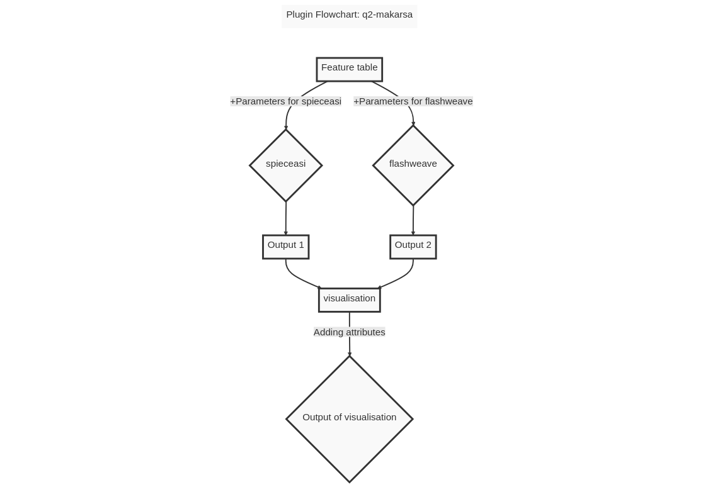

# Summary

**q2-makarsa** is a plugin for the QIIME 2 microbiome bioinformatics platform. The plugin allows the QIIME 2 community to infer microbial ecological networks from community composition data from which we can identify central species and their influences on the species that have interactions with that central species. 

# Statement of need

A microbiome is an inevitable part of life and it can have both positive and negative impacts on human health even though we ignore its presence [@berg2020microbiome]. Interactions of the microbiome with itself and with its host may play a significant role in many areas; for example, food science [@singh2017microbiome; @torrazza2011developing; @foodsecurity2017], health science [@torrazza2011developing; @diease2011] and agricultural production [@berg2020microbiome]. If it is possible to reveal the functions, interactions, temporal and spatial structures, and population dynamics of microbial communities, it will not only be a scientific discovery, but it will also contribute to human health, biotechnological development, agriculture, and environmental protection. To discover the interactions among microbiota within or between ecosystems, network analysis is an important starting point. It allows us to investigate questions from the species level to the community level within a common formal mathematical framework. Here, we present a qiime2 plugin that will help to infer microbial interactions by using network analysis. q2-makarsa is a wrap up plugin of SpiecEasi[@kurtz2015sparse] and FlashWeave[@tackmann2019rapid], both of them are most popular and acceptable tool for microbial network analysis. Among currently available microbial network analysis tools, SpiecEasi has been comparatively widely adopted by the microbiome research community and has been cited over 1000 scientific publications. SpiecEasi has been rigorously tested and benchmarked against other methods for microbial network analysis, and has been shown to perform well across a variety of datasets and scenarios. FlashWeave [@tackmann2019rapid] is another new package used for microbial network analysis, and it is gaining popularity and acceptance in scientific community for its novel algorithm, large-scale analysis and multi-omics integration properties. Both of the packages are actively developed and maintained by dedicated teams of developers, which means that they are regularly updated and improved with new features and bug fixes. Overall, SpiecEasi and FlashWeave are powerful tools for analyzing microbial data and identifying potential interactions between microbial taxa.

**q2-makarsa** performs network analysis of microbiome data. It has two methods for network generation and one visualizer to visualize the generated network.  The name of available methods in q2-makarsa are spieceasi and flashweave, which call SpiecEasi and FlashWeave respectively to generate an ecological network for given compositional data. 

In spieceasi,ecological interactions between microbial populations are infered by 

- taking advantage of the proportionality invariance of relative abundance data and 
- making assumptions about the underlying network structure when the number of taxa in the dataset is larger than the number of sampled communities [@kurtz2015sparse].

It provides several methods for neighbourhood selection, for example mb, glasso, slr etc, and uses StARS for model selection. There are several other parameters that are also used in this plugin, for more details please visit . 
On the otherhand, in flashweave, interactions between microbes are predicted by statistical co-occurrence or co-abundance. To learn more about FlashWeave and its user manual, please visit .

The name of the visualizer of this plugin is 'visualisation' which takes generated network as input and visualizes it in a publication-quality figure. The visualizer provide portable, shareable reports, publication-ready figures, and integrated decentralized data provenance. In this visualizer we have attached some statistical attributes to the network generated from spieceasi method to make our network more attractive and informative. For example, we have added different centrality measurement as node attributes in the generated network. In this case, we have used betweenness centrality, degree centrality and closeness centrality to measure centrality properties of nodes, which can be used in visualisation as size of the nodes of generated network. By doing this we can easily identify which node has most betweenness value in that network, in other word, which node is most influencial in that ecological network. We also have added weights of interactions as edges attribute, although a weighted network is only available for mb and glasso methods, which will help to identify the pair of microbial taxa which have most interactions among any other pair of microbial taxa in that network. Overall, from visualisation, one can easily identified which species are most influential in that community and which pair of microbial species has stronger interactions. In addition,integration as a QIIME 2 plugin, makarsa supports the use of multiple user interfaces, including a prototype graphical user interface (q2studio), facilitating its use for non-expert users. The plugin is freely available under the BSD-3-Clause license at .

The q2-makarsa plugin is written in Python, Julia [@bezanson2017julia], and R, and employs pandas [@mckinney2011pandas] for data manipulation, networkx [@hagberg2020networkx] and igraph [@csardi2006igraph] for network generation and visualization. We also used html [@raggett1999html] and javaScript[@arnold2005java] in some parts of our programming. The plugin is compatible with macOS and Linux operating systems.

{width=40%}   {width=40%}

The standard workflow and an overview of this plugin are shown in \autoref{fig:grl} [@kurtz2015sparse]. q2-makarsa action accepts inp.file (i.e., matrix of feature counts per sample),out.file, method, lambda.min.ratio, nlambda, rep.num, ncores, thresh, subsample.ratio, seed, sel.criterion, verbose, pulsar.select, lambda.log, lambda.min and lambda.max as input for spieceasi method, and input_file,  input_meta, output, minclustersize, maxclustersize, pcadimension, nthreads, seed, alpha, nruns, subsampleratio, numclusters, maxoverlap and verbose for flashweave method. All of the input parameter has default values except input.file for spieceasi and input_file for flashweave. . The visualizer takes network object as input and then visualizes that network.

# Acknowledgements

The authors acknowledge support from University of Dhaka, Bangladesh and UNSW Canberra, Australia. This work is a partial fullfillment of PhD research at UNSW Canberra.
# References
