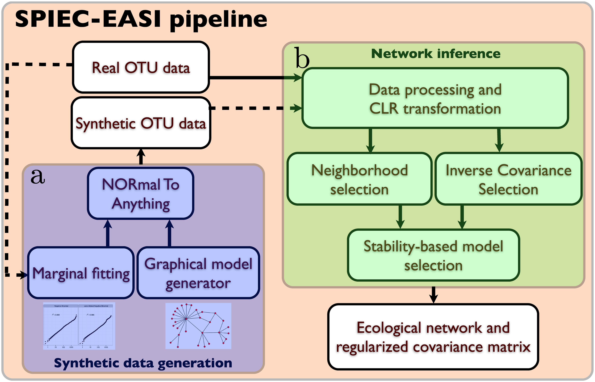

# Summary

# Statement of need

q2-prettyeasi is a plugin for the QIIME 2 microbiome bioinformatics platform that will give the opportunity to infer networks from  community composition data by which we can easily identify central species and their influence to the species who have interactions with that central species. 

Microbiome are inevitable part of human life and have both positive and negative impact on human life although we always ignore their presence due to their small size [@berg2020microbiome]. Interaction of microbiome with itself and also with remaining world may play a significance rule in many sectors for example food science [@singh2017microbiome; @torrazza2011developing], health science [@torrazza2011developing] and agricultural production etc. If it is possible to reveal the functions, interactions, temporal and spatial structures, and population dynamics of microbial communities, it will not only be a scientific discovery, but it will also contribute to other sectors such as human health, biotechnological development, agricultural development, environmental protection. In our current project, we have developed a qiime2 plugin which will help to infer  microbial interactions by using network analysis.

We describe q2-prettyeasi, a QIIME 2 plugin to perform network analysis of microbiome data. It infers ecological interactions between microbial populations, by 

- taking advantage of the proportionality invariance of relative abundance data and 
- making assumptions about the underlying network structure when the number of taxa in the dataset is larger than the number of sampled communities [@kurtz2015sparse].

It provides several methods for neighborhood selection, for example mb, glasso, slr etc, and uses StARS for model selection.
there are several other parameters that are also used in this plugin, for more details please visit . The visualizations generated provide portable, shareable reports, publication-ready figures, and integrated decentralized data provenance. in addition, integration as a QIIME 2 plugin streamlines data handling and supports the use of multiple user interfaces, including a prototype graphical user interface (q2studio), facilitating its use for non-expert users. The plugin is freely available under the [BSD-3-Clause license](https://github.com/qiime2/q2-sample-classifier).

The q2-prettyeasi plugin is written both in Python  and R, and employs pandas [@mckinney2011pandas] for data manipulation, networkx [@hagberg2020networkx] and igraph [@csardi2006igraph] for network generation and visualization. The plugin is compatible with macOS and Linux operating systems.

{width=30%}

The standard workflow for q2-prettyeasi is shown in \autoref{fig:grl} [@kurtz2015sparse]. q2-prettyeasi action accept a input-file (i.e., matrix of feature counts per sample), method, lambda.min.ratio, nlambda, rep.num, ncores,  thresh, subsample.ratio, seed, sel.criterion, verbose, pulsar.select, lambda.log, lambda.min and lambda.max as input. All of the input parameter has default values except input-file.

# Acknowledgements
